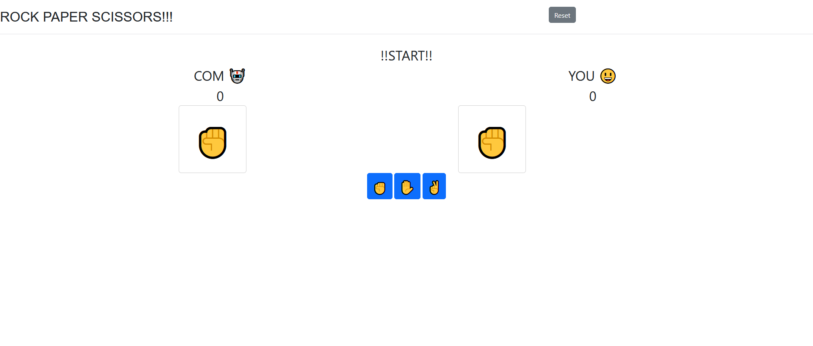

# Rock-Paper-Scissor-web-app

A simple flask app to play rock paper scissors against the computer.

Run the flask app by using the env in RPS-env (it runs in the default 5000 port).

PS: I vaguely remember making this over a weekend 
